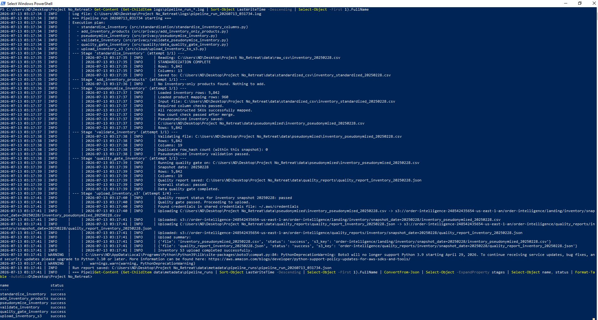
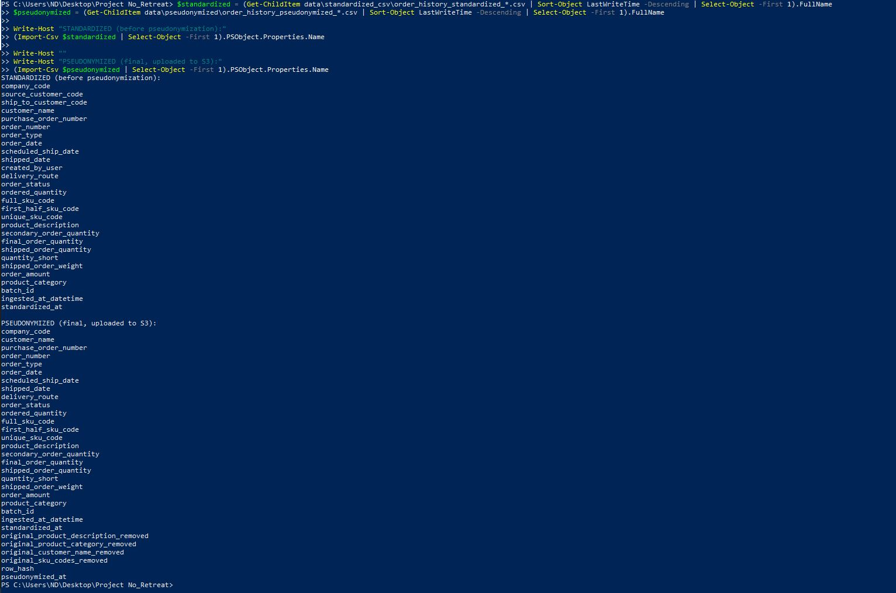
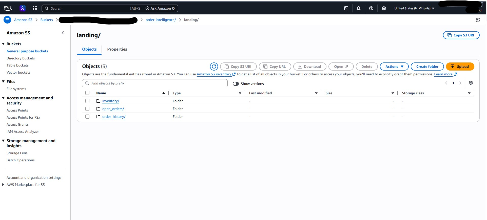

# Order Intelligence Pipeline

## Why this exists

Order history, open orders, and inventory all live inside the same legacy business system. Getting any of it out means someone manually running an export to Excel. There's no API and no direct database connection, nothing scheduled. Each export contains real customer names, real product identifiers, and real employee usernames sitting in plain columns next to order amounts and delivery routes.

I wanted to build real analytics on top of this data, the kind of thing that eventually turns into dashboards, demand forecasting, maybe a machine learning layer, without any of that flowing through in the clear to whoever ends up touching it downstream. That's the actual reason this pipeline pseudonymizes customer names, product descriptions, and SKU codes before anything leaves the local machine. It isn't a portfolio decoration. It's the actual constraint I was working under.

This repo is the first real piece of that. Get the export in reliably, strip the sensitive fields consistently across every run, check the output isn't garbage before it goes anywhere, and land it in S3. Everything after that, a real warehouse, dbt models, BI, machine learning, and eventually Airflow for scheduling, is later work, not built yet.

**What's in this repo:** pipeline code, plus small synthetic samples, fewer than twenty rows per dataset, so the pipeline can actually be run end to end without needing real business data. No real customer information and nothing that traces back to an actual person or company is included anywhere. The `.gitignore` excludes real data files by default.

For the reasoning behind specific design choices, the things that didn't work on the first try, and how I actually know this pipeline does what it claims — see **[docs/DECISIONS.md](docs/DECISIONS.md)**.


## Architecture


All three datasets, order history, open orders, and inventory, come from the same legacy system, pulled through separate export processes. They all pseudonymize through the same shared customer, product, and SKU identity mappings, so a given customer or product resolves to the same fake identity no matter which dataset it shows up in.

Because the mappings are shared, order history's mapping stages, profiling and assigning pseudo IDs to every customer, product, and SKU, have to run first. Everything else builds on top of that. Open orders and inventory can each reference a customer or product that hasn't shown up in order history yet, an order placed before it ships, stock received before it's ever been ordered, so a small backfill stage in each of those tracks adds exactly those missing entities to the shared mapping before pseudonymizing.

From there, each of the three datasets runs its own pseudonymize, validate, quality gate, and upload sequence, landing in its own S3 path. They're independent on purpose. A quality failure in one dataset doesn't block the other two from uploading.

Every stage is a standalone script that reads whatever the previous stage's latest output is and writes its own output. The filesystem is the interface between stages, not shared memory. That makes each stage independently runnable and debuggable on its own.

`run_pipeline.py` orchestrates all of it as subprocesses, not a scheduler, not a DAG engine, just a script that runs each stage in order, logs everything, and stops on the first critical failure. This is meant to be a step toward Airflow, not a replacement for it. Once there's a real warehouse layer to coordinate against, the stage logic here should translate fairly directly into Airflow tasks. Why not Airflow yet, why pseudonymization is incremental rather than rebuilt each run, and a few other real design calls are covered in [docs/DECISIONS.md](docs/DECISIONS.md).


## Proof of a real run




More screenshots, including the stage status table and the before/after column comparison, are in [docs/images](docs/images).


Order history pseudonymized and landed in S3 under its own partitioned path, batch ID matching the run that produced it. Bucket name blurred, everything else is real output from a real run against real data volume.


## Reproducibility

The repo includes small synthetic samples, fewer than twenty rows per dataset, matching the real column structures. That's enough to clone this and actually run the full pipeline end to end without needing your own export. If you do have a real export in the same shape, the column mappings in `config/column_mapping.py`, `config/column_mapping_open_orders.py`, and `config/column_mapping_inventory.py` describe exactly what each script expects.

**Requirements:**
```
Python 3.9+ (3.10+ recommended, boto3 drops 3.9 support in April 2026)
pip install -r requirements.txt
AWS CLI configured with credentials that can write to your target S3 bucket
```

**Environment variables** (required before the upload stages will run):
```powershell
$env:S3_BUCKET = "your-bucket-name"
$env:S3_PREFIX = "order-intelligence"   # optional, this is already the default
$env:AWS_REGION = "us-east-1"            # optional, this is already the default
```

**Running it:**
```powershell
# See the plan without running anything
python src\run_script\run_pipeline.py --list
python src\run_script\run_pipeline.py --dry-run

# Full run, all three datasets, through to S3
python src\run_script\run_pipeline.py

# Everything except the actual S3 uploads, the safest way to validate a change
python src\run_script\run_pipeline.py --to quality_gate_inventory

# Resume from a specific stage after fixing something
python src\run_script\run_pipeline.py --from pseudonymize_open_orders

# Re run just one dataset's track without touching the others
python src\run_script\run_pipeline.py --from standardize_inventory
```

Each stage can also be run standalone, for example `python src\privacy\pseudonymize_order_history.py`, for debugging a single step without re running everything ahead of it.

Order history and open orders identify a batch by an intraday identifier down to the minute. Inventory identifies a snapshot by date only. See [docs/DECISIONS.md](docs/DECISIONS.md) for why that distinction is deliberate. Ingestion for both the main export and the inventory export refuses to silently re process an unchanged source file. Pass `--force` to any ingestion script if re ingesting the same file is actually intentional.


## Repository structure

```
src/
├── ingestion/          Excel to CSV, one script for the main export, one for inventory
├── standardization/    Column renaming and validation, one script per dataset
├── privacy/            Pseudonymization: customer, product, and SKU mapping,
│                        per dataset pseudonymize and validate scripts, backfill
│                        stages for entities not yet seen in order history, and
│                        the SCD2 migration script (designed, not yet deployed)
├── quality/             Data quality gates, one per dataset
├── cloud/                S3 uploads, one per dataset
└── run_script/           Pipeline orchestrator
config/
├── paths.py                        Single source of truth for every directory path
├── column_mapping.py               Order history: raw source code to readable name
├── column_mapping_open_orders.py   Open orders: same idea, different raw schema
└── column_mapping_inventory.py     Inventory: same idea, different raw schema again
docs/
├── DECISIONS.md          Tradeoffs, limitations, debugging notes, evaluation
└── images/                Architecture diagram
```

`data/` and `logs/` are excluded from this repository by default, aside from the small synthetic samples noted above. See `.gitignore`.


## What's next

A real warehouse layer (Snowflake), dbt models — including finally deploying the SCD2 customer dimension as a proper `dbt snapshot`, and incremental fact loading using the `row_hash` that's already being computed — then BI and ML on top of that. Separate work, separate write-up, when it exists.
