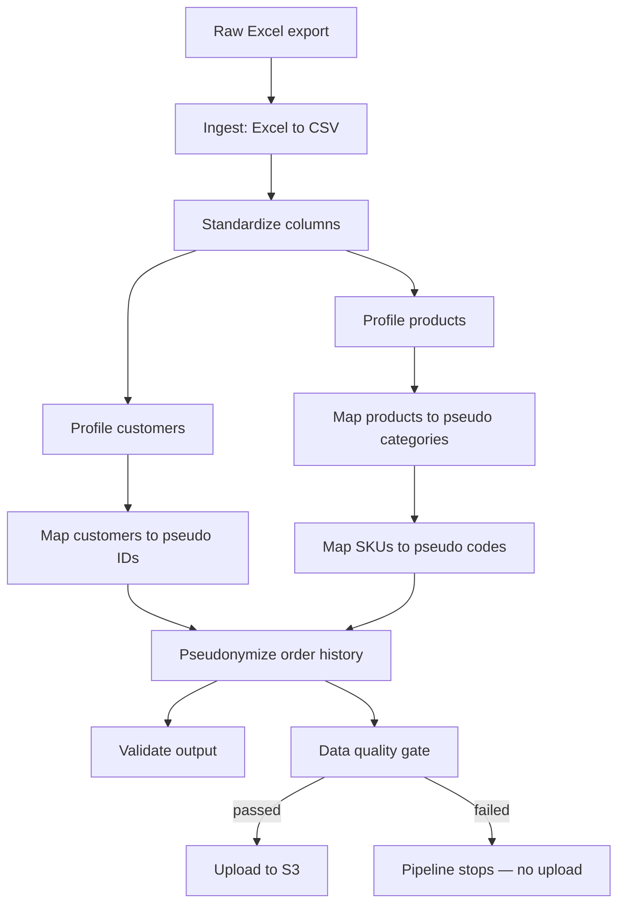

# Order Intelligence Pipeline

A production-grade data pipeline that ingests order history from a legacy system, pseudonymizes sensitive fields, validates data quality, and lands the result in S3 — built as the foundation for a full analytics engineering platform (Snowflake → dbt → BI/ML).

> **Note on data:** this repository contains pipeline code only. No real business data, customer information, or company data is included or referenced. All examples and screenshots use pseudonymized or synthetic values.

---

## The problem

Order history lives in a legacy system and is exported manually as Excel. Before this data can be used for analytics, BI, or ML — by people or tools that shouldn't see real customer names, product identifiers, or employee data — it needs to be:

1. Extracted reliably, on a recurring (weekly) basis
2. Pseudonymized, so downstream consumers never see real customer/product identities
3. Quality-checked, so bad data never silently reaches production
4. Delivered to cloud storage in a structured, auditable way

This repo is the pipeline that does that.

---

## Architecture



Every stage is a standalone, independently runnable Python script. `run_pipeline.py` orchestrates them end to end, but any stage can be run, tested, or debugged on its own.

---

## Key engineering decisions

**Incremental pseudonymization, not full rebuilds.** Customer, product, and SKU mappings are built incrementally — every run preserves every pseudo-ID ever assigned and only generates new ones for genuinely new entities. This matters because downstream analytics depends on `Customer CUST-000123` meaning the same real customer forever, across every batch.

**Idempotency guards at ingestion.** The pipeline refuses to re-ingest an unchanged source file (via content hashing), preventing accidental duplicate batches from a re-run or a scheduler firing twice.

**A quality gate that's actually load-bearing.** `data_quality_gate.py` runs required-column, null, pseudonymization-format, and row-hash checks, and writes a structured report. Failing checks raise a non-zero exit — which stops the orchestrator before the upload stage runs. `upload_pseudonymized_to_s3.py` independently re-checks the same quality report and the batch-ID linkage before uploading, so the gate can't be silently bypassed by running the upload stage on its own.

**Atomic writes everywhere.** Every stage writes to a temp file and renames it into place, so a crash mid-write can never leave a corrupted file at a path a downstream stage will pick up.

**A durable identity vs. a mutable attribute.** Early on, the customer identity key included the customer's *name* — meaning a routine name correction (typo fix, legal rename) would silently fork a "new" customer with a new pseudo ID, breaking continuity. This was found, and rearchitected as a proper SCD Type 2 dimension: identity is keyed on stable business codes only, with name changes tracked as versioned history against a stable pseudo ID.

**Every stage was smoke-tested, not just reviewed.** Several real bugs were caught this way during development — a pandas merge column-collision that only manifested on the second incremental run, a batch-ID linkage regression that would have permanently blocked S3 uploads, and a version of the upload script that didn't check the quality gate's result at all before uploading. All were caught and fixed before reaching production.

---

## Pipeline stages

| Stage | Script | Purpose |
|---|---|---|
| 1 | `ingestion/excel_to_csv_pipeline.py` | Excel → per-sheet CSV, with idempotency + schema validation |
| 2 | `standardization/standardize_order_columns.py` | Renames  column codes to meaningful names; fails loudly on schema drift |
| 3 | `privacy/profile_customers.py` | Extracts the current universe of unique customers |
| 4 | `privacy/customer_mapping_pipeline.py` | Assigns/preserves pseudo customer identities |
| 5 | `privacy/product_profile.py` | Extracts the current universe of unique products |
| 6 | `privacy/pseudonymize_products.py` | Assigns/preserves pseudo product categories & descriptions |
| 7 | `privacy/sku_mapping_pipeline.py` | Assigns/preserves pseudo SKU codes |
| 8 | `privacy/pseudonymize_order_history.py` | Joins all mappings onto order history; replaces every sensitive field |
| 9 | `privacy/validate_pseudonymize_order_history.py` | Secondary sanity check (non-blocking) |
| 10 | `quality/data_quality_gate.py` | Full quality check suite; blocks the pipeline on failure |
| 11 | `cloud/upload_pseudonymized_to_s3.py` | Final upload, gated on quality status + batch-ID match |

Orchestrated by `run_script/run_pipeline.py`.

---

## Running it

```bash
# See the execution plan without running anything
python src/run_script/run_pipeline.py --list
python src/run_script/run_pipeline.py --dry-run

# Full run, excel to S3 (requires S3_BUCKET env var)
python src/run_script/run_pipeline.py

# Run a subset (e.g. everything except the actual upload)
python src/run_script/run_pipeline.py --to quality_gate

# Resume from a specific stage after fixing an issue
python src/run_script/run_pipeline.py --from pseudonymize_orders
```

Required environment variables before running the upload stage:
```bash
export S3_BUCKET="your-bucket-name"
export S3_PREFIX="order-intelligence"   # optional
export AWS_REGION="us-east-1"                  # optional
```

---

## Tech stack

Python · pandas · boto3 · AWS S3

---

## Roadmap

This pipeline is the ingestion/landing layer of a larger analytics engineering platform. Planned next:

- **Snowflake** — staging + curated layers on top of the S3 landing zone
- **dbt** — incremental models using the already-computed `row_hash` for change detection on the fact table, and `dbt snapshot` for proper SCD Type 2 dimension modeling
- **Orchestration** — migrating `run_pipeline.py`'s stage logic into Airflow DAGs
- **BI** — dashboards on top of the curated Snowflake layer
- **ML/GenAI** — demand forecasting and a natural-language query layer over the curated data

---

## Repository structure

```
src/
├── ingestion/          # Excel -> CSV
├── standardization/    # Column renaming/validation
├── privacy/            # Pseudonymization stages
├── quality/            # Data quality gate
├── cloud/               # S3 upload
└── run_script/          # Pipeline orchestrator
config/
├── paths.py             # Single source of truth for all directory paths
└── column_mapping.py    # column code -> readable name mapping
```

`data/` and `logs/` are excluded from this repository — see `.gitignore`.