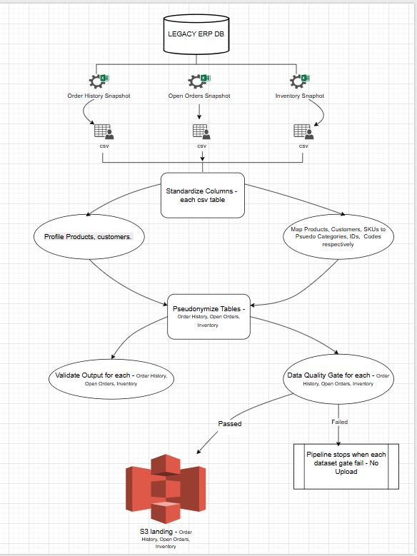

# Order Intelligence Pipeline

## Why this exists

Order history/Open Orders/Inventory data live in legacy system. Getting data out of it means someone manually running an export to Excel. There's no API, no direct database connection, nothing scheduled. That export contains real customer names, real product identifiers, and real employee usernames sitting in plain columns next to order amounts and delivery routes.

I wanted to build real analytics on top of this data — the kind of thing that eventually turns into dashboards, demand forecasting, maybe an ML layer — without any of that flowing through in the clear to whoever ends up touching it downstream. That's the actual reason this pipeline pseudonymizes customer names, product descriptions, and SKU codes before anything leaves the local machine: it's not a portfolio decoration, it's the actual constraint I was working under.

This repo is the first real piece of that: get the export in reliably, strip the sensitive fields consistently across every run, check the output isn't garbage before it goes anywhere, and land it in S3. Everything after that — a real warehouse, dbt models, BI, ML — is later work, not built yet.

**What's in this repo:** pipeline code only. No real business data, no real customer information, nothing that traces back to an actual person or company. The data files themselves are excluded — see `.gitignore`.

For the reasoning behind specific design choices, the things that didn't work on the first try, and how I actually know this pipeline does what it claims — see **[docs/DECISIONS.md](docs/DECISIONS.md)**.

---

## Architecture

## Architecture




Order history and open orders run as two tracks through the same pipeline, but they're not independent — open orders reuses the exact same customer/product/SKU pseudonym mappings that order history builds, so a customer resolves to the same fake identity in both datasets. That means open orders can't be pseudonymized until order history's mapping stages have already run; the orchestrator runs order history's full track to completion first, then runs open orders on top of it.

Every stage is a standalone script that reads whatever the previous stage's latest output is and writes its own output — the filesystem is the interface between stages, not shared in-memory state. That makes each stage independently runnable and debuggable on its own.

`run_pipeline.py` orchestrates all of it as subprocesses — not a scheduler, not a DAG engine, just a script that runs each stage in order, logs everything, and stops on the first critical failure. Why not Airflow yet, why pseudonymization is incremental rather than rebuilt each run, and a few other real design calls are covered in [docs/DECISIONS.md](docs/DECISIONS.md).

---

## Reproducibility

This repo doesn't include real data, so running it end-to-end requires your own AS/400-shaped export — or a synthetic one matching the column structure in `config/column_mapping.py` / `config/column_mapping_open_orders.py`.

**Requirements:**
```
Python 3.9+ (3.10+ recommended — boto3 drops 3.9 support in April 2026)
pip install -r requirements.txt
AWS CLI configured with credentials that can write to your target S3 bucket
```

**Environment variables** (required before the upload stages will run):
```powershell
$env:S3_BUCKET = "your-bucket-name"
$env:S3_PREFIX = "order-intelligence"   # optional, this is already the default
$env:AWS_REGION = "us-east-1"            # optional, this is already the default
```

**Running it:**
```powershell
# See the plan without running anything
python src\run_script\run_pipeline.py --list
python src\run_script\run_pipeline.py --dry-run

# Full run, both order history and open orders tracks, through to S3
python src\run_script\run_pipeline.py

# Everything except the actual S3 upload — safest way to validate a change
python src\run_script\run_pipeline.py --to quality_gate_open_orders

# Resume from a specific stage after fixing something
python src\run_script\run_pipeline.py --from pseudonymize_orders
```

Each stage can also be run standalone (e.g. `python src\privacy\pseudonymize_order_history.py`) for debugging a single step without re-running everything ahead of it.

---

## Repository structure

```
src/
├── ingestion/          Excel -> CSV
├── standardization/    Column renaming/validation per dataset
├── privacy/            Pseudonymization stages (customer, product, SKU, order history, open orders)
├── quality/             Data quality gates
├── cloud/                S3 upload
└── run_script/           Pipeline orchestrator
config/
├── paths.py                        Single source of truth for every directory path
├── column_mapping.py               Order history: raw code -> readable name
└── column_mapping_open_orders.py   Open orders: same idea, different raw schema
docs/
└── DECISIONS.md          Trade-offs, limitations, debugging notes, evaluation
```

`data/` and `logs/` are excluded from this repository entirely — see `.gitignore`.

---

## What's next

Inventory ingestion and pseudonymization, then a real warehouse layer (Snowflake), dbt models — including finally deploying the SCD2 customer dimension as a proper `dbt snapshot`, and incremental fact loading using the `row_hash` that's already being computed — then BI and ML on top of that. Separate work, separate write-up, when it exists.